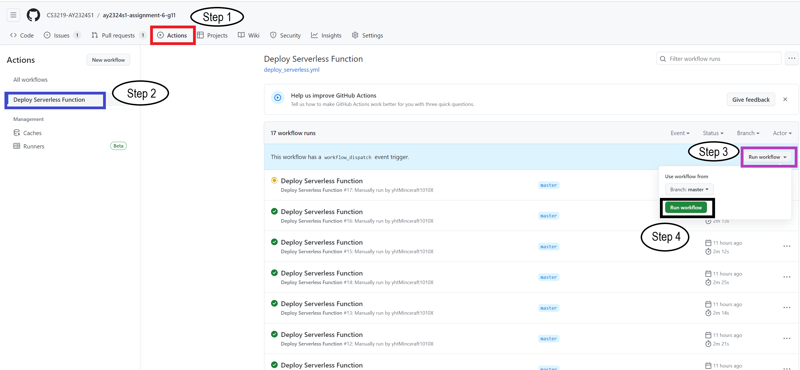

# Assignment 6

## How to run:

1. Go to the `Actions` tab of the project repo. Screenshot for step 1 is shown below:
2. Click on the name of the workflow (in this case `Deploy Serverless Function`)
3. The workflow is run manually. In the `This workflow has a workflow _dispatch` event trigger,
select `Run workflow` drop-down and check that branch is `master`.
4. Click on `Run workflow button`. 

Screenshot below:

## Caveat:
You will need collaborator access to this repository to do the above steps. Feel free to contact any of us to request
for this access if necessary.
